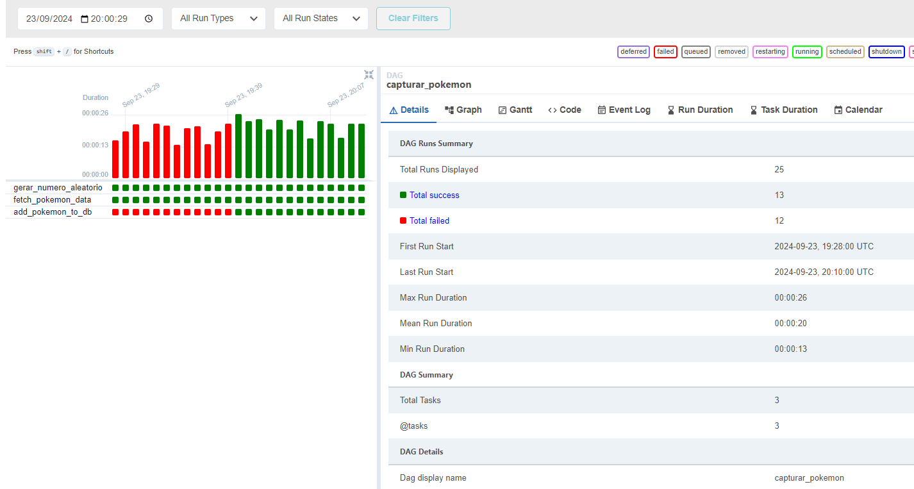
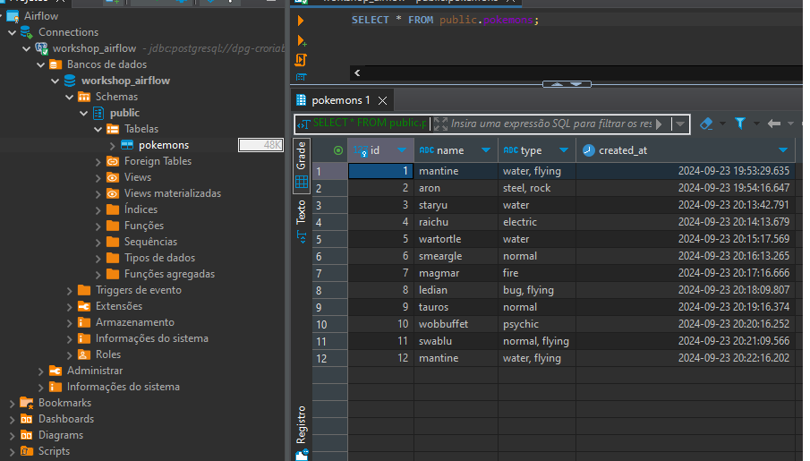

# Orquestração de ETLs 

O Apache Airflow é uma plataforma projetada para criar, agendar e monitorar fluxos de trabalho de forma programática.

Quando os fluxos de trabalho são definidos como código, eles se tornam mais fáceis de manter, versionar, testar e colaborar.

1) Por que não consigo usar o Airflow apenas executando um “pip install apache-airflow”?

O Apache Airflow necessita de uma **Infraestrutura**

- Web Server; 
- Scheduler; 
- Log; 
- Banco de Dados (Postgres); 

Como subir toda essa infra?

Para isso foi utilizado o Astro CLI

```bash
astro dev init
```

2) O que é uma DAG?

Uma DAG (**Directed Acyclic Graph ou Grafo Acíclico Direcionado**) é o conceito central do Airflow, reunindo Tarefas, organizadas com dependências e relações para dizer como elas devem ser executadas.

Ela define as Tarefas (**tasks**), dita a ordem na qual devem ser executadas e suas interdependências, além da frequência que irão rodar. 

A DAG não se preocupa com o que está acontecendo dentro das tarefas, apenas se preocupa em como executa-las, ordem de execução, quantas vezes tentar novamente em caso de falha, tempo de espera, etc. 



3) Como refatorar um código para usar o Airflow?

**É possível transformar qualquer código Python em uma DAG.**

Exemplo: Utilizando decorador `@dag` para transformar uma função em um gerador de DAG:
```python
import datetime

from airflow.decorators import dag
from airflow.operators.empty import EmptyOperator

@dag(start_date=datetime.datetime(2024, 3, 23), schedule="@daily", catchup=False)
def gerar_dag():
    EmptyOperator(task_id="tarefa")

gerar_dag()
```

**Além disso ainda é possível criar dependências entre códigos Python e chamar apenas o "main.py" para dentro da DAG.**

Exemplo: Coletando dados de uma API Pokemon e armazenando-os em um Postgres localizado na Cloud Render. 
```python
from airflow.decorators import task, dag

from include.controller import fetch_pokemon_data, add_pokemon_to_db, gerar_numero_aleatorio

from datetime import datetime

@dag(dag_id="capturar_pokemon",
     description="pipeline_para_capturar_pokemon",
     start_date=datetime(2024,3,23),
     schedule="* * * * *",
     catchup=False)
def capturar_pokemon():

    @task(task_id='gerar_numero_aleatorio')
    def task_gerar_numero_aleatorio():
        return gerar_numero_aleatorio()

    @task(task_id='fetch_pokemon_data')
    def task_fetch_pokemon_data(numero_aleatorio):
        return fetch_pokemon_data(numero_aleatorio)
    
    @task(task_id='add_pokemon_to_db')
    def task_add_pokemon_to_db(pokemon_data):
        add_pokemon_to_db(pokemon_data)
    
    t1 = task_gerar_numero_aleatorio()
    t2 = task_fetch_pokemon_data(t1)
    t3 = task_add_pokemon_to_db(t2)

    t1 >> t2 >> t3

capturar_pokemon()
```


4) O que é um Operator?

Ele **facilita o uso de algumas ferramentas abstraindo-as** e possibilitando que o desenvolvedor usufrua de uma simples função. 

Até quando isso é bom? 
Bom... depende de caso para caso, mas se você não quer ficar "amarrado", uma boa opção é você desenvolver sua própria solução, no caso seu próprio Operator. 